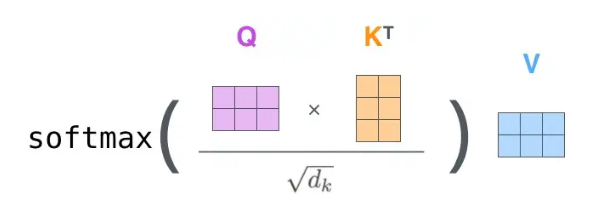
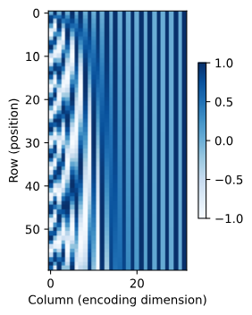
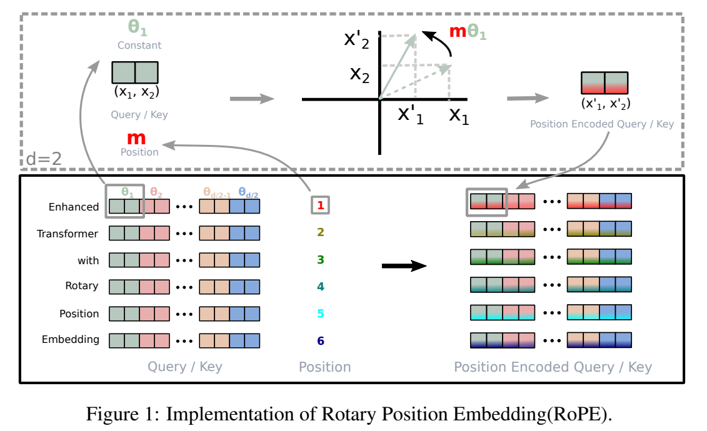

# attention

### 1、attention本质是什么？

有：一个query ，多个【key，value】对，

得到对value加权求和的值。

通过qk运算，可以得到想要的权重（注意力分数）。

### 2、如何得到注意力分数？

$$
f(q) = \sum_{i=1}^n \alpha(q, k_i) v_i
$$

要如何计算 $\alpha（q, k_i）$？

1）60年代提出的Nadaraya-Watson 核回归

$$
f(x)=\sum_{i=1}^{n} \frac{K\left(x-x_{i}\right)}{\sum_{j=1}^{n} K\left(x-x_{j}\right)} y_{i}
$$

&#x20;    $K(x)$ 取高斯核函数

$$
\begin{aligned} f(x) &=\sum_{i=1}^{n} \frac{\exp \left(-\frac{1}{2}\left(x-x_{i}\right)^{2}\right)}{\sum_{j=1}^{n} \exp \left(-\frac{1}{2}\left(x-x_{j}\right)^{2}\right)} y_{i} \\ &=\sum_{i=1}^{n} \operatorname{softmax}\left(-\frac{1}{2}\left(x-x_{i}\right)^{2}\right) y_{i} \end{aligned}
$$

&#x20;         加入可以学习的参数

$$
f(x)=\sum_{i=1}^{n} \operatorname{softmax}\left(-\frac{1}{2}\left(\left(x-x_{i}\right) w\right)^{2}\right) y_{i}
$$

&#x20;    2） 加法

$$
a(\mathbf{q}, \mathbf{k})=\mathbf{w}_{v}^{\top} \tanh \left(\mathbf{W}_{q} \mathbf{q}+\mathbf{W}_{k} \mathbf{k}\right) \in \mathbb{R}
$$

&#x20;     相当于将q和k拼接起来，放到一个mlp里头。&#x20;

&#x20;    3） 点积

&#x20; 使用点积可以得到**计算效率更高**的评分函数， 但是点积操作要求查询和键具有相同的长度d。  &#x20;

$$
a(\mathbf{q}, \mathbf{k})=\mathbf{q}^{\top} \mathbf{k} / \sqrt{d}
$$

### 3、自注意力

&#x20;    通过三个映射函数，将token转化为Q、K、V张量

1）为什么Q和K使用不同的权重矩阵生成？

还是表示能力（模型处理输入的复杂关系，而得到理想的输出）的问题。

权重矩阵是什么？是特征的投影，如果K和Q是同一类特征的投影，那就会对表示能力进行限制（受限于输入特征的分布）。（可以理解为一种正则化）。

Q专注于表达目标

K专注以表达上下文内容

2）为什么用点乘不用加法

内积更适合衡量向量之间的相似性。

性能表现：点乘有相似性运算，加法只是简单的相加，不提供相似度度量。不能直接用于注意力权重的归一化，得跟个mlp。

计算效率： 点乘可以试用矩阵运算，硬件友好，加法需要逐个元素计算。

工程实践：如果加法好的话，肯定有很多人做了，相信大势所趋。性能和效果肯定优于其他算法。

3）softmax之前scaled的作用

这里的scaled指的是，QK计算内积之后，除以了 $\sqrt{d}$ ：



这里有两个关键，一个是除号，一个是 $d$ ，结合起来就是为了防止$d$过大带来的影响。

$d$过大带来什么影响？ 正如原文中说的，会出现过大的值，而梯度消失。

这里的过大的值，是因为Q和K两个随机变量的点积，每一个结果，都是d对数相乘结果的累加，其方差为

$$
var(q \cdot k^T) = var(\sum_{i=0}^{d_k}q_i \times k_i)
=d_k 
$$

方差大了，那出现极大值的概率就大了。当有一个很大的最大值，通过e指数的运算，其softmax结果就无限接近1，其他值接近0，则softmax就退化成了argmax。

然后我们计算softmax的反向：

$$
y_i =\frac {e^{x_i}} {\sum_{j=1}^{n}e^{x_j}}
 
$$

$$
\mathbf{J}=\left[\begin{array}{cccc}y_{1}\left(1-y_{1}\right) & -y_{1} y_{2} & \cdots & -y_{1} y_{n} \\ -y_{2} y_{1} & y_{2}\left(1-y_{2}\right) & \cdots & -y_{2} y_{n} \\ \vdots & \vdots & \ddots & \vdots \\ -y_{n} y_{1} & -y_{n} y_{2} & \cdots & y_{n}\left(1-y_{n}\right)\end{array}\right]
$$

所以如果输出 $y = [0, 0...,1...,0]$的话，那梯度就消失了。

综上：d大了 → 点积结果方差大 → 最大值极大 → softmax退化成argmax → 梯度消失

所以解决方案也很简单，解决这条链中的任意一个，通用的方案就是把方差变小，除以 $\sqrt{d}$ ，就可以把方差控制为1。

4）encoder和decoder的区别

&#x20; encoder和decoder的主要区别有两点

1、encoder用的是self attention，而decoder用的是cross attention，不过这区别在decoder only结构中就不复存在了

2、decoder在attention运算之后，softmax之前，多了一个mask。这个结构十分适配生成任务，预测下一个token时，只关注当前token以及之间的内容。

&#x20; 目前，市面上的大模型基本都是decoder only的模型，从实验角度，decoder only的模型在zero shot任务上表现更好，泛化方面考虑的优势：

1、encoder的双向注意力会存在低秩问题，可能削弱模型的表达能力。针对模型

$$
Attenion (\mathbf{X})=\mathbf{W}_{v} \mathbf{X} \cdot \operatorname{Softmax}\left[\frac{\left(\mathbf{W}_{k} \mathbf{X}\right)^{\top}\left(\mathbf{W}_{q} \mathbf{X}\right)}{\sqrt{d_{k}}}\right]=\mathbf{W}_{v} \mathbf{X} \cdot \mathbf{P}
$$

对于自然界可能存在的任意的P，当X的维度d\<n时，无法找到一定的W满足该公式。而decoder是一个满秩三角阵，可以完全表达单向的P，无法完全表达双向的P。

但也存在疑问，即不能证明这个单向满秩三角阵比双向低秩三角阵弱。

2、预训练任务难度，预测下一个token的难度更高，通用表征的上限更高

3、上下文学习，prompt可以更加直接地作用在decoder每一层的参数，微调信号更强

4、casual attention具有隐式编码能力。双向attention对语序的区分能力天生更弱。语言生成有天然的马尔科夫性，decoder-only的token by token的生成方式更加契合生成任务。

工程实践方面的优势：decoder 结构可以试用KV cache ，多轮对话时加速推理；目前的成熟框架和技巧megatron和flash attention等对decoder only的结构更友好。

5\) 为什么要用多头注意力

性能，丰富token之间的关系运算，从不同的“子空间”提取信息，使得模型对输入序列的理解更加全面。同时，不同的Q K V，可以增加模型的diverse，增加了对输入的多样化表达，从而增强模型的表示能力。

效率，天然地支持TP运算。

训练，增加训练时候的稳定性，多几个头相当于多了一些冗余。就像MoE中其实不是每个专家都需要激活，在attention中，其实也可以剪枝，有些注意力头是不需要的。多训几个号，就少一些一个训飞的可能性。

6）位置编码

为了在输入中加入相对的或者绝对的位置信息，使用可学习或者固定的位置编码

**绝对位置**

对于 $X \in R^{n\times d}$，有位置编码矩阵$P \in R^{n\times d}$

$$
p_{i,2j} = sin(\frac{i}{10000^{2j/d}}), p_{i,2j+1} = cos(\frac{i}{10000^{2j/d}})
$$

其奇数列和偶数列分别使用sin和cos函数，每一列的周期不同。

这个设计是参考二进制数字逐步递增时的更新频率，低位更新频率更高而高位更新频率更低。



**相对位置**

现在的LLM中，更多的是使用相对位置编码，这符合我们对语言的理解，我们看一句话，更多的是看两个词之间的位置，而不是绝对位置。其实上述的位置编码本就包含了相对位置信息，因为对于任意偏移的 $\delta$,  $(p_{i,2j}, p_{i,2j+1})$ 都可以通过线性映射得到$(p_{i+\delta,2j}, p_{i+\delta,2j+1})$

$$
\begin{split}\begin{aligned}
&\begin{bmatrix} \cos(\delta \omega_j) & \sin(\delta \omega_j) \\  -\sin(\delta \omega_j) & \cos(\delta \omega_j) \\ \end{bmatrix}
\begin{bmatrix} p_{i, 2j} \\  p_{i, 2j+1} \\ \end{bmatrix}\\
=&\begin{bmatrix} \cos(\delta \omega_j) \sin(i \omega_j) + \sin(\delta \omega_j) \cos(i \omega_j) \\  -\sin(\delta \omega_j) \sin(i \omega_j) + \cos(\delta \omega_j) \cos(i \omega_j) \\ \end{bmatrix}\\
=&\begin{bmatrix} \sin\left((i+\delta) \omega_j\right) \\  \cos\left((i+\delta) \omega_j\right) \\ \end{bmatrix}\\
=&
\begin{bmatrix} p_{i+\delta, 2j} \\  p_{i+\delta, 2j+1} \\ \end{bmatrix},
\end{aligned}\end{split}
$$

下面介绍几个常用的位置编码

Rope旋转位置编码

用于llama1/2、Qwen1.5、Qwen2、Mistral等

这是目前最常用的位置编码，主要解决的一个痛点就是大模型的**外推性**，即训练时和推理时，上下文长度不一样的情况，来看操作：

在dim维度进行切分，两两配对，再计算旋转矩阵，示意如下：



假设对Query进行位置编码，具体操作公式：

对于 $Q\in R^{d\times s}$，有s个d维张量 $Q_j = [q_1, q_2,...,q_d]$ ，对于第j个 $Q_j$ 计算

$$
\theta_i = Base^{\frac{-2(i-1)}{d}}, i \in (1,2,...,\frac{d}{2}) ,Base 默认为10000
$$

$$
Q_i^{(R)} = [-q_{d/2+1}, -q_{d/2+2},...,-q_{d},
\\ q_1, q_2,...,q_{d/2}]
 
$$

$$
Q^{Rotary} = Q_i \odot [cos j\theta_1, cos j\theta_2,...,cos j\theta_{d/2}, 
\\cos j\theta_1, cos j\theta_2,...,cos j\theta_{d/2}] 
\\+ Q_i^{(R)} \odot [sin j\theta_1, sin j\theta_2,...,sin j\theta_{d/2}, 
\\sin j\theta_1, sin j\theta_2,...,sin j\theta_{d/2}],
\\j\in(1,2,3...,s) 
$$

llama代码如下：

```python 
def precompute_freqs_cis(dim: int, seq_len: int, theta: float = 10000.0):
    # 计算词向量元素两两分组之后，每组元素对应的旋转角度
    freqs = 1.0 / (theta ** (torch.arange(0, dim, 2)[: (dim // 2)].float() / dim))
    # 生成 token 序列索引 t = [0, 1,..., seq_len-1]
    t = torch.arange(seq_len, device=freqs.device)
    # freqs.shape = [seq_len, dim // 2] 
    freqs = torch.outer(t, freqs).float()
    # 假设 freqs = [x, y]
    # 则 freqs_cis = [cos(x) + sin(x)i, cos(y) + sin(y)i]
    freqs_cis = torch.polar(torch.ones_like(freqs), freqs)
    return freqs_cis

def apply_rotary_emb(
    xq: torch.Tensor,
    xk: torch.Tensor,
    freqs_cis: torch.Tensor,
) -> Tuple[torch.Tensor, torch.Tensor]:
    # xq.shape = [batch_size, seq_len, dim]
    # xq_.shape = [batch_size, seq_len, dim // 2, 2]
    xq_ = xq.float().reshape(*xq.shape[:-1], -1, 2)
    xk_ = xk.float().reshape(*xk.shape[:-1], -1, 2)
    
    # 转为复数域
    xq_ = torch.view_as_complex(xq_)
    xk_ = torch.view_as_complex(xk_)
    
    # 应用旋转操作，然后将结果转回实数域
    # xq_out.shape = [batch_size, seq_len, dim]
    xq_out = torch.view_as_real(xq_ * freqs_cis).flatten(2)
    xk_out = torch.view_as_real(xk_ * freqs_cis).flatten(2)
    return xq_out.type_as(xq), xk_out.type_as(xk)

class Attention(nn.Module):

    def forward(self, x: torch.Tensor):
        bsz, seqlen, _ = x.shape
        xq, xk, xv = self.wq(x), self.wk(x), self.wv(x)

        xq = xq.view(batch_size, seq_len, dim)
        xk = xk.view(batch_size, seq_len, dim)
        xv = xv.view(batch_size, seq_len, dim)

        # attention 操作之前，应用旋转位置编码
        xq, xk =  apply_rotary_emb (xq, xk, freqs_cis=freqs_cis)
```


Scaling Rope

DeepSeek里头用的是linear Scaling Rope，在计算完 $\theta_i$ 之后，多了一个scale操作。

$$
\theta_i = \frac{Base^{\frac{-2(i-1)}{d}}}{factor}, i \in (1,2,...,\frac{d}{2}) ,Base 默认为10000,factr取值为4
$$

其实这也是一个为了实现Rope外推的目的，属于线性内插，通过增加一个scale操作，让其可以表征更长的上下文。

对于 $j\theta_i$，可以将factor作为除数得到linear scaling rope： $\frac{j\theta_i}{factor}$, 也可放在其他位置上，本质上都是让一个 $j\theta_i$ 变小：

$$
j^{(\frac{1}{factor})}\theta_i
$$

$$
j(\frac{Base}{factor})^{\frac{-2(i-1)}{d}}
$$

$$
j({Base})^{\frac{-2(i-1)}{factor \cdot d}}
$$
