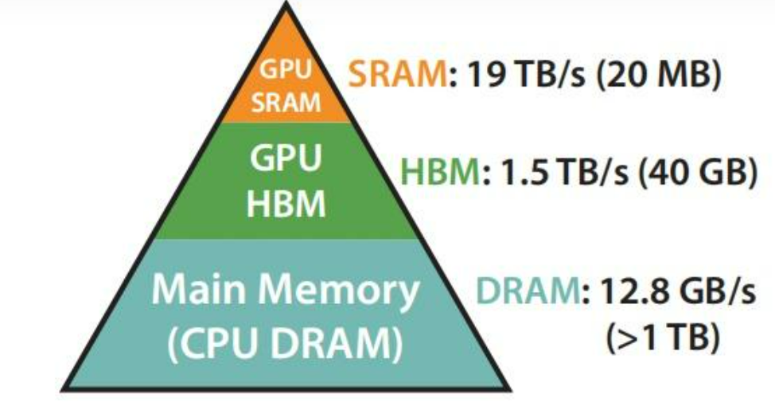
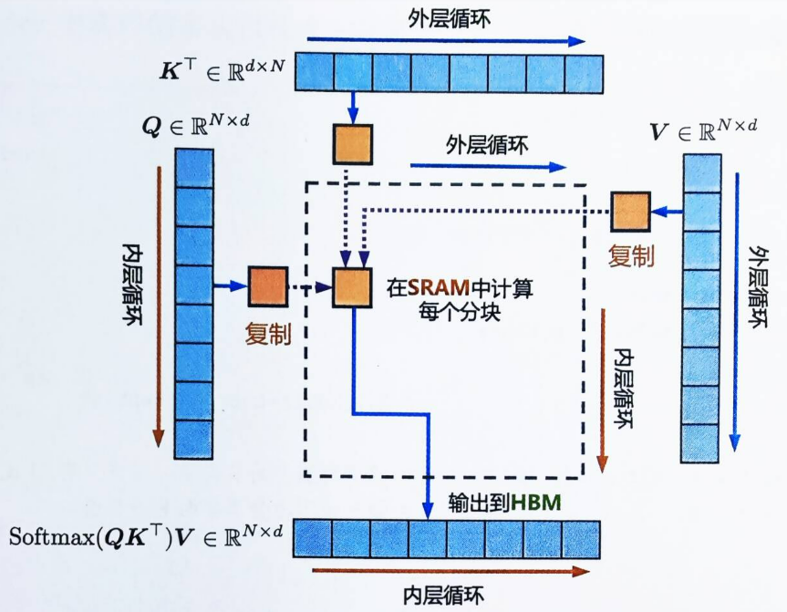
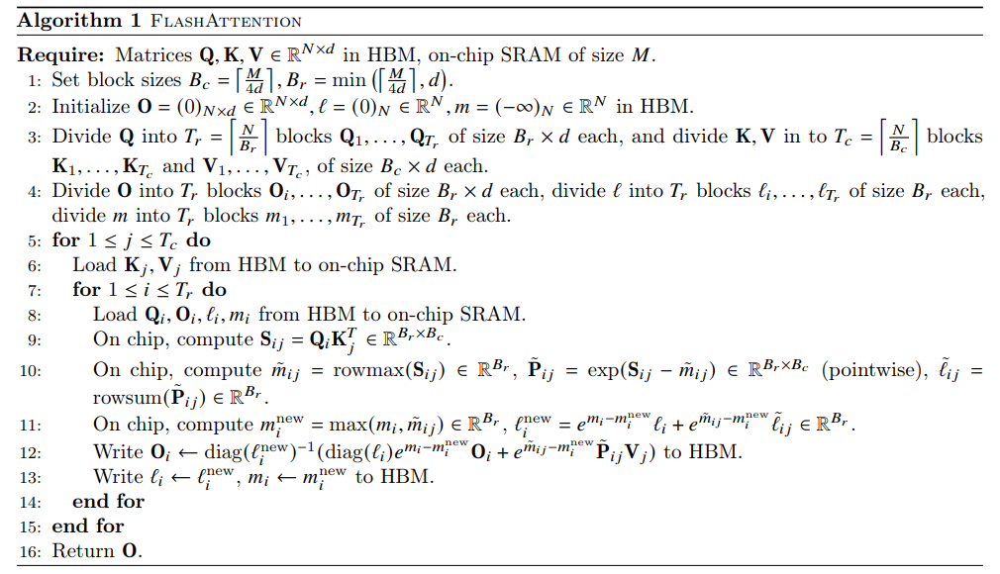
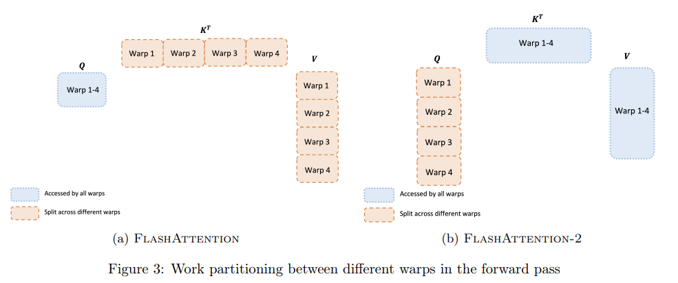
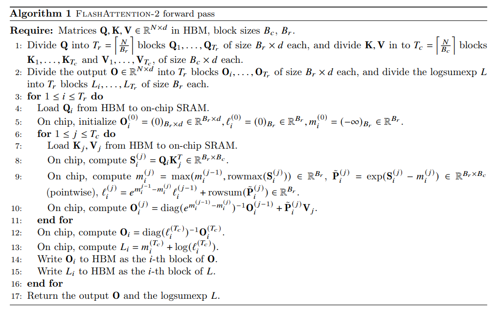

# 【attention2】\*\* Flash Attention：从 V1 到 V4 的计算方法与优化之路\*\*

## 0. 引言

flash attention是从硬件的角度来加速训练过程的手段

其计算结果完全一致，只是通过减少HBM和SRAM的之间的读写来突破通信受限

如下是A100的内存分布：



GPU中的SRAM访问速度更快但内存更小，attention的计算需要反复将数据从HBM传输到SRAM机型计算，再保存回HBM中。Flash attention希望可以一次性算完，然后返回HBM，减少读写次数。但因为SRAM空间太小，没办法一次性算完所有的数据，所以flash attention主要解决的是如何分块运算attention 模块

***

***

## 1. Flash Attention V1：在线 Softmax 与分块计算

论文:  FlashAttention: Fast and Memory-Efficient Exact Attention with IO-Awareness

链接：[https://arxiv.org/abs/2205.14135](https://arxiv.org/abs/2205.14135 "https://arxiv.org/abs/2205.14135")

- **1.1 V1 的基本思想**
  - 通过“tiling”（分块计算）将 $N \times N$的 Attention 矩阵拆分成多个小块，确保每个块能装进高速 SRAM 中
  - 引入在线（Online）Softmax 方法，避免完整 materialization（写回）中间矩阵
  - kernel 融合，跳过中间结果的搬运，直接将attention的计算结果计算出来
  - 重运算，不保存中间结果，而是在反向时，重新计算相应的中间结果矩阵
- **1.2 矩阵的分块运算**
  - GPU运算矩阵乘的原理
    - 因为GPU的存储结果，首先都需要将HBM上的大矩阵进行分块，分块保存到SRAM上，然后进行运算
  - 在线更新公式推导，这里因为不能一下把所有的x的计算出来，QKV会分段传输进来，所以使用分块和递推的方式
    - 递推公式：
      - 更新当前块的最大值 $m_i = \max(m_{i-1}, x_i)$
      - 指数和更新: $d_i' = d_{i-1}' \, e^{m_{i-1}-m_i} + e^{x_i-m_i}$
    - 在实际操作时，每一块先计算自己的最大值以及指数和，再通过递推公式，更新所有块的结果，保证所有块的计算结果都是全局的softmax。
- **1.3 在线Softmax 算法详解**
  - &#x20;softmax 的计算公式如下：

    $\mathrm{softmax}(x_i)=\frac{e^{x_i-m(x)}}{\sum_{j} e^{x_j-m(x)}}$

    其中 $m(x)$表示 $x_0 ... x_n$的最大值，这是防止数值溢出的手段
  - 在线更新公式推导，这里因为不能一下把所有的x的计算出来，QKV会分段传输进来，所以使用分块和递推的方式
    - 递推公式：
      - 更新当前块的最大值 $m_i = \max(m_{i-1}, x_i)$
      - 指数和更新: $d_i' = d_{i-1}' \, e^{m_{i-1}-m_i} + e^{x_i-m_i}$
    - 在实际操作时，每一块先计算自己的最大值以及指数和，再通过递推公式，更新所有块的结果，保证所有块的计算结果都是全局的softmax。
- **1.4 V1 算法流程图与伪代码展示**

  

```python 
def flash_attention(Q, K, V, block_size_q, block_size_k):
    """
    Flash Attention 伪代码：
    - Q, K, V 存储在 HBM（全局内存）中
    - 算法将 Q、K、V 分块，并在 SRAM 内部完成局部 softmax 计算
      后在线更新归一化统计量，从而避免整体写入大矩阵。
    
    参数：
      Q: [N, d] 查询矩阵
      K: [N, d] 键矩阵
      V: [N, d] 值矩阵
      block_size_q: Q 分块的行数（SRAM 能够容纳的块大小）
      block_size_k: K、V 分块的行数

    返回：
      O: [N, d] 输出矩阵
    """
    N, d = Q.shape
    # 输出矩阵 O 初始化在 HBM 中
    O = np.zeros((N, d), dtype=Q.dtype)
    # 在线 softmax 累计量，m 用于存储每行当前的最大值，d_sum 存储累积的指数和
    m_acc = -np.inf * np.ones((N,), dtype=Q.dtype)
    d_acc = np.zeros((N,), dtype=Q.dtype)

    # 计算 Q 分块和 K/V 分块的数量
    num_blocks_q = int(np.ceil(N / block_size_q))
    num_blocks_k = int(np.ceil(N / block_size_k))

    # 外循环：遍历每个 K/V 块（HBM -> SRAM）
    for j in range(num_blocks_k):
        k_start = j * block_size_k
        k_end = min((j + 1) * block_size_k, N)
        # 从 HBM 加载当前块的 K 和 V 到 SRAM
        K_block = load_from_HBM(K, k_start, k_end)  # [B_k, d]
        V_block = load_from_HBM(V, k_start, k_end)  # [B_k, d]

        # 内循环：遍历每个 Q 块（HBM -> SRAM）
        for i in range(num_blocks_q):
            q_start = i * block_size_q
            q_end = min((i + 1) * block_size_q, N)
            # 从 HBM 加载当前 Q 块以及对应累积输出、统计量到 SRAM
            Q_block = load_from_HBM(Q, q_start, q_end)     # [B_q, d]
            O_block = load_from_HBM(O, q_start, q_end)     # [B_q, d]
            m_block = m_acc[q_start:q_end].copy()          # [B_q]
            d_block = d_acc[q_start:q_end].copy()          # [B_q]

            # 计算局部得分矩阵：S = Q_block * K_block^T  （在 SRAM 内计算）
            S = np.matmul(Q_block, K_block.T)  # [B_q, B_k]
            # 对每一行计算局部最大值
            local_max = np.max(S, axis=1)  # [B_q]
            # 计算局部指数：exp(S - local_max) 并求和得到局部归一化因子
            exp_S = np.exp(S - local_max[:, None])  # [B_q, B_k]
            local_sum = np.sum(exp_S, axis=1)         # [B_q]

            # 更新每一行的全局最大值和累积指数和（在线 softmax 递推更新）
            new_m = np.maximum(m_block, local_max)  # [B_q]
            # 修正之前的累积指数和：乘以 exp(m_block - new_m)
            new_d = d_block * np.exp(m_block - new_m) + local_sum

            # 计算当前块产生的部分输出：
            # 先计算局部 softmax 权重：exp(S - local_max)
            # 再根据新归一化因子对当前块输出进行修正
            P = exp_S / new_d[:, None]  # [B_q, B_k]
            partial_O = np.matmul(P, V_block)  # [B_q, d]

            # 累加输出：需要对之前累积的输出进行同样的归一化修正
            O_block = O_block * (d_block / new_d) * np.exp(m_block - new_m) + partial_O

            # 将更新后的累积统计量和输出写回 HBM（SRAM -> HBM）
            write_to_HBM(O, q_start, q_end, O_block)
            m_acc[q_start:q_end] = new_m
            d_acc[q_start:q_end] = new_d

    return O

# 示例调用（数据尺寸仅为说明用途）
if __name__ == '__main__':
    N, d = 1024, 64
    # 模拟在 HBM 上的数据（numpy 数组）
    Q = np.random.randn(N, d).astype(np.float32)
    K = np.random.randn(N, d).astype(np.float32)
    V = np.random.randn(N, d).astype(np.float32)
    # 设定分块大小（实际值需根据硬件 SRAM 容量选择）
    block_size_q = 128
    block_size_k = 128

    O = flash_attention(Q, K, V, block_size_q, block_size_k)
    # 此时 O 就是经过 Flash Attention 算法计算出的输出

```


原文中的算法流程如下：



1、设定分块大小：以A100为例，这里的on-chip SRAM of size $M$大小为192KB，每次SRAM中需要存下QKV和O，计算如下

$$
M ≥ B_r \times d + 2B_c \times d + B_r \times d
\\B_r+B_c <= M
$$

2、通过KV外循环，Q内存换的形式将QKV的分块和保存的中间值从HBM上加载到SRAM中

3、使用递推公式更新

4、将结果保存回HBM中

- **1.4 常见Q\&A**
  - Q：为什么要对 softmax 做“减最大值”的操作？
    - A：防止指数计算时溢出，提升数值稳定性
  - Q：分块计算如何降低内存访问量？
    - A：每次只加载当前块数据到 SRAM 内部计算，无需实例化整个 $N \times N$矩阵

***

## 2. Flash Attention V2：循环置换与并行优化

- **2.1 V2 的改进动机**
  - GPU 上非矩阵乘法运算（如除法、逐点操作）的性能远低于矩阵乘法
  - 如何减少非矩阵运算、提高整体 GPU 计算利用率
  - 反向传播时，仅仅达到A100 GPU最大吞吐量的25-35%
- **2.2 主要优化点**
  - 内外循环交换：将原本“KV 外循环、Q 内循环”的顺序调整为“Q 外循环、KV 内循环”，使得 softmax 的归一化更自然
  - 前向预算优化：将每次迭代中除法操作合并到循环外，从而将每次循环中的除法次数由 2N 次降低到 1 次
    - 计算局部attention，先不考虑指数和

      v1:  $O_{i} = diag(l_i)^{-1} (diag(l_i)e^{m_i-m_i^new}O_i +e^{\hat m_{ij}-m_i^{new}} \hat{P_{ij}V{j}})$

      v2: $O_{i} = e^{m_i-m_i^new}O_i +e^{\hat m_{ij}-m_i^{new}} \hat{P_{ij}V{j}}$
    - 在循环外直接计算：

      v2: $O = diag(l)^{-1}O$
  - 增加对序列维度的并行化（Seq Parallel）：通过划分 Q 的行块，使得 GPU 中更多的 SM 能被充分利用

    v1 使用一个thread block来处理一个attention head

    v2 在序列长度上进行并行化，外循环可以放在不同tehrad block上

    
- **2.3 V2 的伪代码与流程示意图**

  
  - 展示优化前后关键公式对比，图示说明内外循环置换的效果
  - 详细说明 thread block 的划分策略、并行调度方式

***

## 3. Flash Attention V3：异步调度与低精度优化

- **3.1 V3 的背景与挑战**
  - 面对最新硬件（如 H100 GPU）的特性，V2 在利用率上仍有提升空间
  - 针对内存带宽和计算异步性进行进一步优化
- **3.2 V3 的主要优化策略**
  - **异步调度（Asynchrony）**
    - 利用 Producer-Consumer 模型，将数据加载与计算并行（Ping-Pong 流水线）
    - 隐藏 softmax 等低吞吐操作的延迟
  - **低精度计算（FP8）**
    - 引入 FP8 张量核心操作，大幅降低运算开销，同时保持输出精度
  - **Warp-specialization**
    - 重新分配 warp 内部任务，进一步减少线程间通信和共享内存读写
- **3.3 V3 的整体流程与示意图**
  - 展示 V3 版本的硬件调度流程图，说明 Producer 与 Consumer 的协同工作

***

## 4. V4

## 5. 综合比较与展望

- **5.1 Flash Attention 各版本对比**
  - 总结 V1、V2、V3 的核心思想、优化点及性能提升（可以列表对比）
- **5.2 应用场景与优势**
  - 在大模型、长上下文、低内存预算等场景下的应用优势
- **5.3 未来展望**
  - 对未来进一步优化的可能性进行讨论，如更高效的内存管理、硬件新特性利用等

***

下面是模拟算法工程师面试时，围绕 Flash Attention 相关知识点进行的问答示例：

***

**Q1：请简述 Flash Attention 的基本思想以及它解决了哪些传统 Attention 的问题？****A1：** Flash Attention 的核心在于减少传统 Attention 中巨大的内存读写开销。传统 Attention 需要计算并存储一个  $(N \times N)$ 的得分矩阵（其中 (N) 是序列长度），导致内存访问量呈二次级增长，进而成为计算瓶颈。Flash Attention 通过分块（tiling）策略，将整个 Attention 计算拆分为多个小块，在高速片上存储器（SRAM）中完成局部计算，并使用在线 softmax 技术实时更新归一化统计量，从而避免了将整个中间矩阵写回高带宽内存（HBM）。这种设计使内存访问复杂度从 (O(N^2)) 降为近似 (O(N))

***

**Q2：什么是在线 softmax？它在 Flash Attention 中起到了什么作用？****A2：** 在线 softmax 是一种递推式计算 softmax 的方法，不需要一次性处理整个输入向量。具体来说，它通过在每一步更新当前行的最大值和累积指数和，从而实现局部归一化计算。这一机制允许我们在分块计算中，只对当前块进行 softmax 计算，再通过递推将各块结果合并，避免了对整个 $(N \times N)$ 得分矩阵进行存储和多次读写，从而大幅度降低内存访问开销

***

**Q3：Flash Attention V1 如何利用分块计算降低内存读写量？****A3：** 在 V1 中，Attention 的得分矩阵不再整体实例化，而是将  $(QK^T)$ 分块成若干个小矩阵，每个小矩阵都可以在 SRAM 内部完成 softmax 和后续的与 (V) 的乘法。与此同时，采用在线更新统计量（如当前行的最大值 (m) 和累积的指数和 (d)）的方式，将各个块的计算结果迭代融合，从而避免了反复将大矩阵在 HBM 与 SRAM 之间传输

***

**Q4：Flash Attention V2 相比 V1 有哪些主要改进？** &#x20;

**A4：** V2 在 V1 的基础上主要做了两方面改进： &#x20;

1. **内外循环顺序的调整**：将原本“KV 外循环、Q 内循环”的计算顺序调换为“Q 外循环、KV 内循环”，使得每次计算 softmax 时的归一化更自然，且有利于并行化，进一步减少了共享内存的读写冲突。 &#x20;
2. **非矩阵运算的优化**：通过提取并合并循环中重复的除法等非矩阵乘法操作，将这些低效率的计算集中到循环结束时统一处理，从而降低了总的非矩阵运算次数，提高了 GPU 的整体利用率。

***

**Q5：为什么 GPU 上非矩阵乘法操作的性能会成为瓶颈？Flash Attention 如何优化这一点？****A5：** GPU 的矩阵乘法（如通过 Tensor Core 执行的 GEMM）拥有极高的吞吐量，但对于逐元素操作、除法等非矩阵乘法运算，其计算单元的利用率远低于专用的矩阵乘法单元。例如在 A100 上，FP16/BF16 的矩阵乘法可达数百 TFLOPS，而非矩阵乘法则只有几十 TFLOPS。Flash Attention 通过重新设计计算流程，将这些非矩阵运算（如每步的归一化除法）尽可能提取到循环外部，从而减少其执行次数，确保大部分计算都能借助高吞吐量的矩阵乘法单元来完成。

***

**Q6：Flash Attention V3 又有哪些新技术？它主要解决了哪些问题？** &#x20;

**A6：** V3 在 V2 的基础上进一步提升性能，主要引入了以下几项新技术： &#x20;

- **异步调度（Asynchrony）**：采用 Producer-Consumer 模型和 Ping-Pong 调度，使数据加载（从 HBM 到 SRAM）与计算可以重叠执行，从而隐藏了数据传输延迟。 &#x20;
- **低精度计算（FP8）**：利用最新 GPU 支持的 FP8 数制，在保持足够精度的前提下，进一步加速矩阵乘法运算。 &#x20;
- **Warp-specialization**：优化了同一线程块内 warp 之间的任务分配，减少了线程间的通信和共享内存读写。总体上，V3 的优化使得在 H100 等新一代 GPU 上能够更高效地利用硬件资源。

***

**Q7：能否简单解释一下“kernel fusion”在 Flash Attention 中的作用？****A7：** Kernel fusion 指的是将多个计算操作合并为一个 CUDA kernel，从而避免在不同 kernel 之间频繁地将数据在 HBM 和 SRAM 之间传输。在 Flash Attention 中，通过融合分块计算、softmax 和矩阵乘法操作，可以在同一个 kernel 内完成大部分运算，这不仅减少了数据移动次数，还能充分利用 GPU 的并行计算能力，显著提升运行效率。

***

**Q8：在实际应用中，Flash Attention 如何帮助模型处理长上下文问题？****A8：** 传统 Transformer 在处理长序列时，由于内存访问和计算量的二次增长，往往难以扩展到更长的上下文。Flash Attention 通过将 Attention 计算拆分成多个小块，在 SRAM 内部完成局部计算，并在线更新归一化统计量，从而大幅降低了内存读写量，使得模型能够高效处理更长的输入序列。这对于大语言模型（如 GPT、Llama）在长上下文训练和推理时尤其重要。

***

**Q9：请谈谈“tiling”策略在 Flash Attention 中的意义。****A9：** Tiling 策略就是将一个大的  $(N \times N)$ Attention 矩阵分割成多个可以在 SRAM 内计算的小块。每个小块仅涉及一部分 token 之间的相互作用，从而可以局部计算 softmax 和与 (V) 的乘法。这样既避免了整个大矩阵的内存读写问题，也使得每个 tile 的数据能够被高速缓存，从而整体降低了计算延迟并提高了内存利用率。

***

**Q10：总结一下，Flash Attention 主要适用于哪些场景，其优势体现在哪里？** &#x20;

**A10：** Flash Attention 非常适合用于大规模 Transformer 模型和长上下文场景，例如 GPT 系列、Llama 等大语言模型。其主要优势在于： &#x20;

- 显著降低了内存占用和 HBM 读写次数，从 $O(N^2)$ 降至  $O(N)$（或近似线性） &#x20;
- 利用分块计算和在线 softmax 技术，使得在高带宽内存和高速 SRAM 之间的切换更加高效 &#x20;
- 经过 V2 和 V3 的不断优化，可更好地利用 GPU 的矩阵乘法单元和异步执行能力，提高整体训练和推理速度。 &#x20;

因此，在内存和计算资源都极为紧张的场景下，Flash Attention 能使大模型在更长上下文下高效运行.

## One more thing ：FlashMLA
